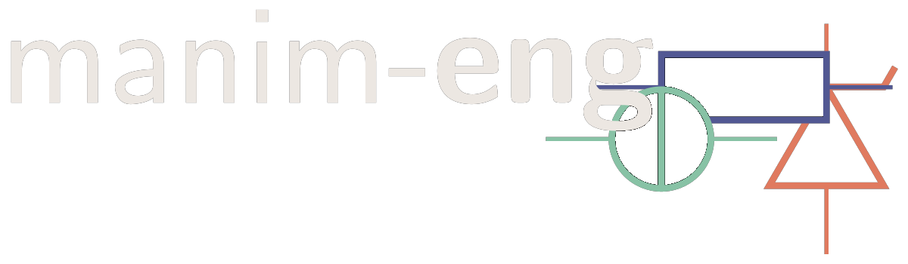
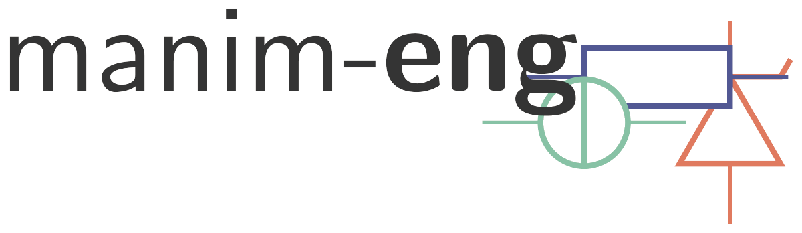

manim-eng is a plugin for `ManimCE <https://manim.community>`_ that introduces Mobjects
for drawing engineering diagrams. Currently this is just limited to circuit diagrams,
but the goal is to extend this to other types of diagrams in the future.

.. note::

    manim-eng is under active development, and as such the API is not yet stable
    version-to-version. (Though minor versions will always maintain the same API, as
    per semantic versioning good practice.)

(Very rough) roadmap
--------------------

v0.2
^^^^
- Multi-terminal components (transistors, logic gates, latches, etc.)
- Different versions of components (European, American, etc.)
- Better, more ergonomic wire routing for circuits
- Polynomial-based voltage arrows

v0.3
^^^^
- Pin-jointed structure mobjects

Contents
--------

.. toctree::
    :maxdepth: 1

    installation
    first_circuit_diagram/index
    guides/index
    reference
    licencing_and_citation
